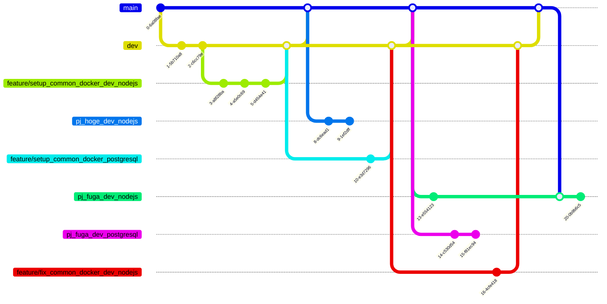

# docker_sandbox
Dockerコンテナを使った開発等ができるように整備する汎用レポジトリ．

## 使い方：共用のDockerfile等を追加・修正する人
基本的にdevブランチから共用のDockerfileを追加・修正するためのブランチを切って作業すること
1. devブランチからブランチ`feature/{任意のブランチ名}`を切る
1. ブランチ`feature/{任意のブランチ名}`で，追加・修正をするディレクトリ`docker/{Dockerサービス名}/`の中の共用のDocker環境の設定ファイル等に対して作業する
1. 必要あれば`docker/{Dockerサービス名}/README.md`を作成・更新する
1. 作業が完了したらブランチ`dev`へのプルリクを投げる
1. 必要あればブランチ`dev`のブランチ`main`へのプルリクを投げる

## 使い方：用意済みのDockerfileを使用してPJ用のDocker環境を作成・修正する人
基本的にmainブランチからPJごとのDocker環境設定するためのブランチを切って作業すること
1. mainブランチからブランチ`pj_{PJ名}_{Docker環境名}`を切る
1. ブランチ`pj_{PJ名}_{Docker環境名}`で，PJの開発やステージングテストに必要なDocker環境の設定等をしてpushしておく
1. 必要あれば`README-PJ.md`で用意したPJ用のDocker環境の使い方を記載する

## 使い方：用意済みのPJ用のDocker環境を使用する人
1. 用意されたブランチ`pj_{PJ名}_{Docker環境名}`をクローンする
1. `README-PJ.md`に記載されたDocker環境の使い方を参考にDocker環境を起動して作業する

## Appendix：構成
```
├ docker_sandbox/
    ├ docker/
        ├ {Dockerサービス名}/
            ├ Dockerfile
            ├ README.md [`docker-compose.yml`・`.env`・`.dockerignore`のサンプル，起動手順を記載]
        ├ dev_nodejs/ [例：NodeJS(バージョン選択可)開発環境]
            ├ Dockerfile
            ├ README.md
        ├ prd_centos/ [例：CentOS(バージョン選択可)本番想定サーバ]
            ├ Dockerfile
            ├ README.md
        ├ postgresql/ [例：PostgreSQL(バージョン選択可)]
            ├ Dockerfile
            ├ README.md
    ├ workspace/
        ├ README.md
        ├ [git cloneするなどしてソースを用意する]
    ├ docker-compose.yml
    ├ .env
```

## Appendix：Gitflowイメージ
- 登場人物(ブランチ)
    - ブランチ`main`：用意済みDockerfileを使用する開発者がPJにおけるDocker環境を用意するための元ブランチ
    - ブランチ`dev`：本レポジトリの共用部分に関する開発ブランチ
    - ブランチ`feature/setup_common_docker_dev_nodejs`：NodeJS開発に関する共用のDockerfileを追加するブランチ
    - ブランチ`pj_hoge_dev_nodejs`：PJ「hoge」におけるNodeJS開発のためのDocker環境を整備しPJ「hoge」の開発メンバに展開するブランチ
    - ブランチ`feature/setup_common_docker_postgresql`：PostgreSQL開発に関する共用のDockerfileを追加するブランチ
    - ブランチ`pj_fuga_dev_nodejs`：PJ「fuga」におけるNodeJS開発のためのDocker環境を整備しPJ「fuga」の開発メンバに展開するブランチ
    - ブランチ`pj_fuga_dev_postgresql`：PJ「fuga」におけるPostgreSQL開発のためのDocker環境を整備しPJ「fuga」の開発メンバに展開するブランチ
    - ブランチ`feature/fix_common_docker_dev_nodejs`：NodeJS開発に関する共用のDockerfileを修正するブランチ
